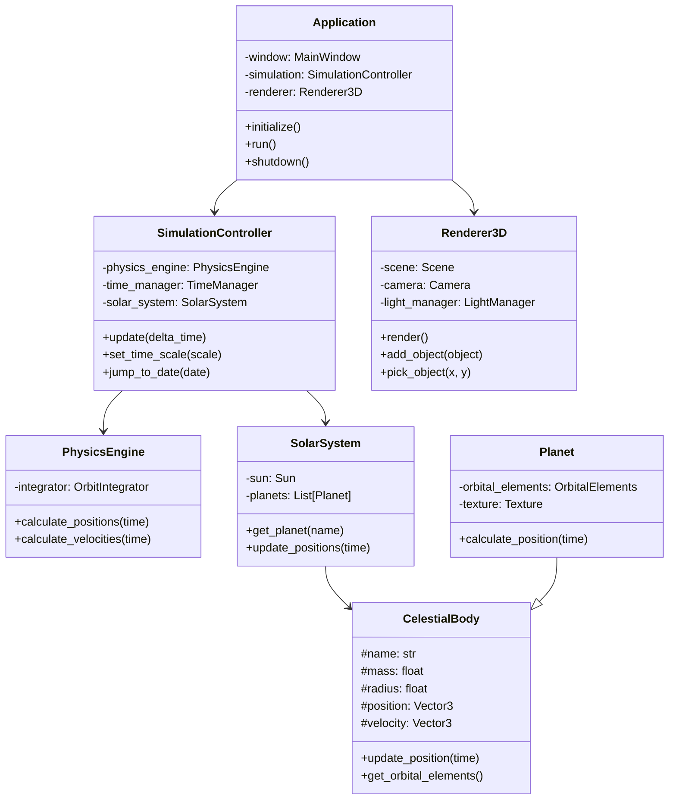
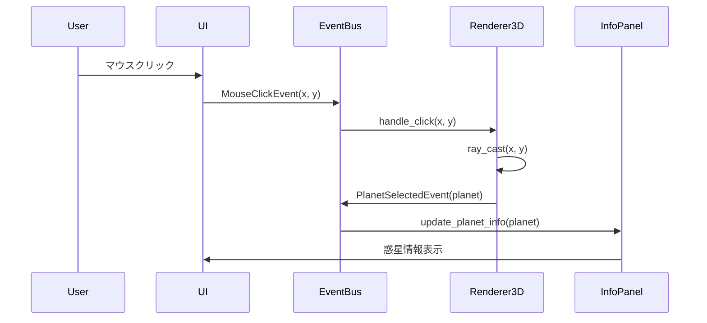

# AstroSim 概要設計書

## 1. システム概要

### 1.1 プロジェクト概要
AstroSimは、太陽系の惑星公転をリアルタイムでシミュレーションする3D可視化アプリケーションです。教育目的から趣味での天文学習まで、幅広いユーザーに対して直感的で科学的に正確な太陽系の動きを提供します。

### 1.2 システムの目的
- 太陽系の惑星運動を視覚的に理解できる環境の提供
- インタラクティブな操作による能動的な学習体験の実現
- 科学的に正確なデータに基づいた信頼性の高いシミュレーション

### 1.3 主要機能
1. **3Dビジュアライゼーション**: 太陽系の惑星を3D空間で表示
2. **リアルタイムシミュレーション**: 実際の軌道データに基づく惑星運動
3. **インタラクティブ操作**: マウスによる視点操作と惑星選択
4. **情報表示**: 選択した惑星の詳細情報表示
5. **時間制御**: シミュレーション速度の調整と特定日時へのジャンプ

## 2. システムアーキテクチャ

### 2.1 アーキテクチャパターン
レイヤードアーキテクチャとMVP（Model-View-Presenter）パターンのハイブリッド構成を採用します。

```
┌─────────────────────────────────────────────┐
│          Presentation Layer                  │
│  ・PyQt6 GUI                                │
│  ・Vispy 3D Visualization                   │
└─────────────────────────────────────────────┘
                    ↑↓
┌─────────────────────────────────────────────┐
│          Application Layer                   │
│  ・Simulation Controller                    │
│  ・Event Management                         │
│  ・Command Processing                       │
└─────────────────────────────────────────────┘
                    ↑↓
┌─────────────────────────────────────────────┐
│            Domain Layer                      │
│  ・Physics Engine                           │
│  ・Celestial Bodies                         │
│  ・Solar System Model                       │
└─────────────────────────────────────────────┘
                    ↑↓
┌─────────────────────────────────────────────┐
│        Infrastructure Layer                  │
│  ・Data Repository                          │
│  ・Configuration Management                 │
│  ・Resource Loading                         │
└─────────────────────────────────────────────┘
```

### 2.2 技術スタック
- **プログラミング言語**: Python 3.8+
- **3Dグラフィックス**: Vispy
- **GUI フレームワーク**: PyQt6
- **科学計算**: NumPy, SciPy, Astropy
- **データ形式**: HDF5 (大規模データ), JSON (設定ファイル)
- **テストフレームワーク**: pytest
- **開発ツール**: black, flake8, mypy

## 3. 機能設計

### 3.1 3Dビジュアライゼーション機能

#### 3.1.1 シーン構成
```
太陽系シーン
├── 太陽（光源）
├── 惑星群
│   ├── 水星
│   ├── 金星
│   ├── 地球
│   ├── 火星
│   ├── 木星
│   ├── 土星
│   ├── 天王星
│   └── 海王星
├── 軌道線（オプション）
└── 背景（恒星）
```

#### 3.1.2 レンダリング要素
- **惑星表現**: 球体メッシュ + テクスチャマッピング
- **軌道表現**: ラインレンダリング（オプション表示）
- **照明**: 太陽を点光源とした物理ベースライティング
- **カメラ**: 自由視点カメラ（回転、ズーム、パン）

### 3.2 物理シミュレーション機能

#### 3.2.1 軌道計算
- **手法**: ケプラーの法則に基づく解析的計算
- **精度**: 摂動を考慮しない2体問題として扱う（初期バージョン）
- **時間積分**: 4次ルンゲ・クッタ法（将来的なN体問題対応用）

#### 3.2.2 時間管理
- **シミュレーション時間**: 1900年〜2100年の範囲
- **時間ステップ**: 可変（1時間〜1年）
- **時間倍率**: 0.1倍〜1000倍速

### 3.3 ユーザーインターフェース機能

#### 3.3.1 メインウィンドウ構成
```
┌─────────────────────────────────────────────┐
│  メニューバー                                │
├─────────────────────────────────────────────┤
│  ツールバー                                  │
├───────────────┬─────────────────────────────┤
│               │                             │
│  コントロール  │      3Dビューポート          │
│   パネル      │                             │
│               │                             │
├───────────────┼─────────────────────────────┤
│          情報パネル                          │
└─────────────────────────────────────────────┘
```

#### 3.3.2 操作体系
- **マウス操作**
  - 左ドラッグ: カメラ回転
  - 右ドラッグ: カメラ移動
  - ホイール: ズーム
  - 左クリック: 惑星選択

- **キーボードショートカット**
  - Space: 再生/一時停止
  - R: 視点リセット
  - F: 選択惑星にフォーカス
  - 1-9: 惑星への直接ジャンプ

## 4. データ設計

### 4.1 惑星データ構造
```json
{
  "planets": [
    {
      "name": "地球",
      "name_en": "Earth",
      "orbital_elements": {
        "semi_major_axis": 1.00000261,
        "eccentricity": 0.01671123,
        "inclination": 0.00001531,
        "longitude_of_ascending_node": -11.26064,
        "argument_of_perihelion": 114.20783,
        "mean_anomaly": 358.617
      },
      "physical_properties": {
        "radius": 6371.0,
        "mass": 5.972e24,
        "rotation_period": 23.934,
        "axial_tilt": 23.44
      },
      "visual_properties": {
        "color": [0.0, 0.5, 1.0],
        "texture": "earth.jpg"
      }
    }
  ]
}
```

### 4.2 設定データ構造
```json
{
  "application": {
    "window_size": [1920, 1080],
    "fullscreen": false,
    "language": "ja"
  },
  "simulation": {
    "start_date": "2024-01-01T00:00:00",
    "time_scale": 1.0,
    "show_orbits": true,
    "show_labels": true
  },
  "graphics": {
    "antialiasing": 4,
    "texture_quality": "high",
    "shadow_quality": "medium"
  }
}
```

## 5. インターフェース設計

### 5.1 クラス図（主要コンポーネント）



### 5.2 シーケンス図（惑星選択）



## 6. 非機能要件

### 6.1 パフォーマンス要件
- **フレームレート**: 最低30FPS、目標60FPS
- **起動時間**: 5秒以内
- **メモリ使用量**: 最大500MB
- **応答時間**: ユーザー操作に対して100ms以内

### 6.2 品質要件
- **可用性**: 99%以上（クラッシュ率1%未満）
- **正確性**: 軌道計算の誤差0.1%以内
- **保守性**: コードカバレッジ80%以上

### 6.3 制約事項
- **動作環境**: Windows 10/11（64bit）
- **必要スペック**: 
  - CPU: Intel Core i5以上
  - RAM: 8GB以上
  - GPU: OpenGL 3.3対応
  - ディスプレイ: 1280×720以上

## 7. 開発計画

### 7.1 フェーズ分割
1. **フェーズ1（基盤構築）**: 3週間
   - 開発環境構築
   - 基本アーキテクチャ実装
   
2. **フェーズ2（MVP開発）**: 4週間
   - 物理エンジン実装
   - 3D表示機能実装
   
3. **フェーズ3（機能拡張）**: 3週間
   - インタラクション機能
   - UI統合
   
4. **フェーズ4（品質保証）**: 2週間
   - テスト実施
   - ドキュメント作成

### 7.2 リスク管理
- **技術リスク**: Vispy学習曲線 → プロトタイプ作成で早期検証
- **性能リスク**: 複数惑星の同時レンダリング → LOD実装で対応
- **スケジュールリスク**: UI実装の遅延 → MVP機能の優先順位付け

## 8. 将来の拡張計画

### 8.1 バージョン2.0機能案
- 衛星の追加（月、木星の衛星など）
- 小惑星帯の表示
- 彗星の軌道シミュレーション
- VR対応

### 8.2 バージョン3.0機能案
- N体問題シミュレーション
- 相対論的効果の考慮
- 宇宙探査機の軌道計画ツール
- Web版の開発

## 9. まとめ

AstroSimは、科学的正確性とユーザビリティを両立した太陽系シミュレーションソフトウェアを目指します。段階的な開発アプローチにより、早期にMVPをリリースし、ユーザーフィードバックを取り入れながら機能を拡張していく計画です。

選定した技術スタックは、高性能な3D表示と科学計算に最適化されており、将来的な拡張にも柔軟に対応できる設計となっています。