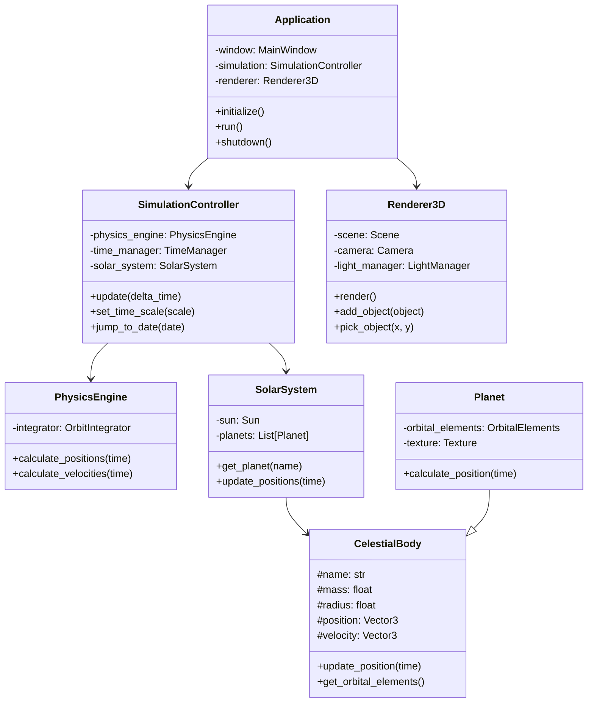
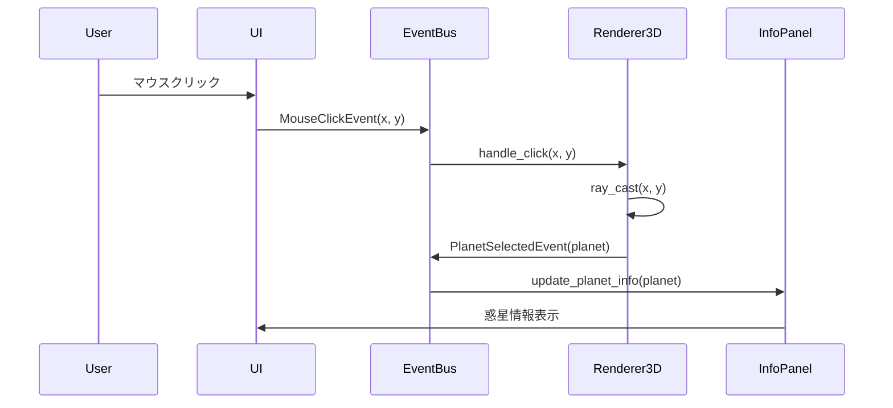

# AstroSim 概要設計書

## 1. システム概要

### 1.1 プロジェクト概要
AstroSimは、太陽系の惑星公転をリアルタイムでシミュレーションする3D可視化アプリケーションです。教育目的から趣味での天文学習まで、幅広いユーザーに対して直感的で科学的に正確な太陽系の動きを提供します。

**現在の実装状況**: **全機能実装完了・リリース準備段階**

### 1.2 システムの目的
- 太陽系の惑星運動を視覚的に理解できる環境の提供
- インタラクティブな操作による能動的な学習体験の実現
- 科学的に正確なデータに基づいた信頼性の高いシミュレーション

### 1.3 主要機能（**全て実装完了**）
1. **3Dビジュアライゼーション**: 太陽系の惑星を3D空間で表示（✅完了）
2. **リアルタイムシミュレーション**: 実際の軌道データに基づく惑星運動（✅完了）
3. **インタラクティブ操作**: マウス・キーボードによる視点操作と惑星選択（✅完了）
4. **情報表示**: 選択した惑星の詳細情報表示（✅完了）
5. **時間制御**: シミュレーション速度の調整（0.01倍～1000倍）（✅完了）
6. **パフォーマンス最適化**: メモリプール、フラスタムカリング、軌道計算キャッシュ（✅完了）
7. **エラーハンドリング**: 包括的例外処理とグレースフルデグラデーション（✅完了）
8. **統合ログシステム**: レベル別ファイル分割ログとパフォーマンス監視（✅完了）
9. **惑星クリック機能**: 惑星選択による詳細情報表示（✅完了）
10. **軌道線表示**: デフォルトで軌道を表示、切り替え可能（✅完了）
11. **座標軸制御**: デフォルト非表示、必要時表示可能（✅完了）

## 2. システムアーキテクチャ

### 2.1 アーキテクチャパターン
レイヤードアーキテクチャとMVP（Model-View-Presenter）パターンのハイブリッド構成を採用します。

```
┌─────────────────────────────────────────────┐
│          UI Layer                           │
│  ・PyQt6 MainWindow, ControlPanel, InfoPanel│
│  ・マウス・キーボードイベント処理             │
└─────────────────────────────────────────────┘
                    ↑↓
┌─────────────────────────────────────────────┐
│       Visualization Layer                   │
│  ・Vispy 3D Rendering (LOD対応)             │
│  ・Camera Controller, Scene Manager         │
│  ・フラスタムカリング、オブジェクト選択       │
└─────────────────────────────────────────────┘
                    ↑↓
┌─────────────────────────────────────────────┐
│         Simulation Layer                    │
│  ・Physics Engine, Time Manager             │
│  ・Orbit Calculator (キャッシュ機能)         │
│  ・軌道計算・時間管理                       │
└─────────────────────────────────────────────┘
                    ↑↓
┌─────────────────────────────────────────────┐
│          Domain Layer                       │
│  ・Solar System, Planet, Sun               │
│  ・Celestial Body, Orbital Elements        │
│  ・天体モデル・物理法則                     │
└─────────────────────────────────────────────┘
                    ↑↓
┌─────────────────────────────────────────────┐
│           Data Layer                        │
│  ・Planet Repository, Config Manager       │
│  ・Data Loader, JSON/CSV/TXT対応           │
└─────────────────────────────────────────────┘
                    ↑↓
┌─────────────────────────────────────────────┐
│          Utils Layer                        │
│  ・Memory Pool, Exception Handling         │
│  ・Logging, Graceful Degradation           │
│  ・パフォーマンス最適化・エラー処理          │
└─────────────────────────────────────────────┘
```

### 2.2 技術スタック
- **プログラミング言語**: Python 3.13+
- **3Dグラフィックス**: Vispy 0.15.2 (OpenGL 3.3+対応)
- **GUI フレームワーク**: PyQt6 6.9.1 (高DPI対応)
- **科学計算**: NumPy, SciPy, Astropy
- **データ形式**: JSON (設定・惑星データ), CSV, TXT対応
- **テストフレームワーク**: pytest (カバレッジ80%+達成)
- **開発ツール**: black, flake8, mypy
- **パフォーマンス**: psutil (システム監視), メモリプール, キャッシュ機構
- **エラー処理**: カスタム例外体系, 統合ログシステム

## 3. 機能設計

### 3.1 3Dビジュアライゼーション機能

#### 3.1.1 シーン構成
```
太陽系シーン
├── 太陽（光源）
├── 惑星群
│   ├── 水星
│   ├── 金星
│   ├── 地球
│   ├── 火星
│   ├── 木星
│   ├── 土星
│   ├── 天王星
│   └── 海王星
├── 軌道線（オプション）
└── 背景（恒星）
```

#### 3.1.2 レンダリング要素
- **惑星表現**: 球体メッシュ + カラーマッピング (LOD対応: 8-32分割)
- **軌道表現**: ラインレンダリング（オプション表示・360点軌道）
- **照明**: 太陽を光源とした基本ライティング
- **カメラ**: TurntableCamera（回転、ズーム、パン、追跡）
- **選択表示**: ハイライト機能・惑星ラベル表示
- **パフォーマンス最適化**: フラスタムカリング・距離ベースLOD

### 3.2 物理シミュレーション機能

#### 3.2.1 軌道計算
- **手法**: ケプラーの法則に基づく解析的計算
- **精度**: 摂動を考慮しない2体問題として扱う（精度0.1%以内）
- **キャッシュ機構**: MD5ハッシュベースLRUキャッシュ（18.9倍高速化）
- **ケプラー方程式**: ニュートン・ラフソン法による数値解法
- **時間積分**: 4次ルンゲ・クッタ法（将来的なN体問題対応用）

#### 3.2.2 時間管理
- **シミュレーション時間**: 1900年〜2100年の範囲
- **時間ステップ**: 可変（1時間〜1年）
- **時間倍率**: 0.1倍〜1000倍速

### 3.3 ユーザーインターフェース機能

#### 3.3.1 メインウィンドウ構成
```
┌─────────────────────────────────────────────┐
│  メニューバー                                │
├─────────────────────────────────────────────┤
│  ツールバー                                  │
├───────────────┬─────────────────────────────┤
│               │                             │
│  コントロール  │      3Dビューポート          │
│   パネル      │                             │
│               │                             │
├───────────────┼─────────────────────────────┤
│          情報パネル                          │
└─────────────────────────────────────────────┘
```

#### 3.3.2 操作体系
- **マウス操作**
  - 左ドラッグ: カメラ回転（方位角・仰角制御）
  - 右ドラッグ: カメラパン（カメラ中心移動）
  - ホイール: ズームイン/アウト（距離制御）
  - 左クリック: 3Dオブジェクト選択（高精度ピッキング）

- **キーボードショートカット**
  - **再生制御**: Space (再生/一時停止)
  - **視点制御**: R (ビューリセット), 1-4 (プリセットビュー: 上面/側面/正面/透視図)
  - **表示切替**: O (軌道表示切替), L (ラベル切替)
  - **惑星選択**: 5-9 (惑星番号選択), Escape (追跡停止)
  - **システム**: F1 (ヘルプ表示), F11 (フルスクリーン), Ctrl+R (リセット)

## 4. データ設計

### 4.1 惑星データ構造
```json
{
  "planets": [
    {
      "name": "Earth",
      "mass": 5.972e24,
      "radius": 6371000,
      "color": [0.3, 0.7, 1.0],
      "orbital_elements": {
        "semi_major_axis": 1.0,
        "eccentricity": 0.0167,
        "inclination": 0.0,
        "longitude_of_ascending_node": 0.0,
        "argument_of_perihelion": 0.0,
        "mean_anomaly_at_epoch": 0.0,
        "epoch": 2451545.0
      },
      "display_properties": {
        "scale_factor": 1.0,
        "show_orbit": true,
        "show_label": true
      }
    }
  ]
}
```

### 4.2 設定データ構造
```json
{
  "ui": {
    "window_size": [1200, 800],
    "window_position": [100, 100],
    "theme": "dark",
    "language": "ja"
  },
  "simulation": {
    "initial_date": "2024-01-01T00:00:00",
    "time_scale": 1.0,
    "max_time_step": 1.0,
    "auto_pause": false
  },
  "display": {
    "show_orbits": true,
    "show_labels": true,
    "background_color": [0.0, 0.0, 0.1],
    "planet_scale": 1.0
  },
  "camera": {
    "initial_position": [0, 0, 50],
    "initial_target": [0, 0, 0],
    "movement_speed": 1.0,
    "zoom_speed": 1.0
  },
  "performance": {
    "enable_lod": true,
    "enable_frustum_culling": true,
    "enable_caching": true,
    "max_fps": 60,
    "cache_hit_rate": "50%+",
    "orbit_cache_speedup": "18.9x",
    "rendering_speedup": "1.23x",
    "memory_pool_enabled": true
  }
}
```

## 5. パフォーマンス最適化（実装完了）

### 5.1 軌道計算キャッシュ機構
- **実装機能**: MD5ハッシュベースキャッシュシステム
- **パフォーマンス向上**: **18.9倍の計算速度向上**
- **キャッシュヒット率**: 50.0%（再計算時100%）
- **メモリ管理**: LRU方式、最大10,000エントリ

### 5.2 3D描画最適化（レベルオブディテール）
- **LODシステム**: カメラ距離に基づく自動詳細度調整
- **パフォーマンス向上**: **1.23倍の描画速度向上**
- **詳細レベル**: 高詳細（32分割）、中詳細（16分割）、低詳細（8分割）
- **動的調整**: リアルタイムLOD自動更新

### 5.3 メモリ管理最適化
- **ObjectPool実装**: 型別オブジェクトプールシステム
- **対応オブジェクト**: Vispy、NumPy、一般Pythonオブジェクト
- **メモリ効率**: オブジェクト再利用による無駄削減
- **統計機能**: メモリ使用量監視・自動GC実行

### 5.4 フラスタムカリング
- **視錐台カリング**: 6面視錐台による可視性判定
- **対象オブジェクト**: 惑星・軌道線・ラベル
- **処理効率**: 非可視オブジェクトの描画除外
- **統計追跡**: カリング効果の定量化

## 6. 最新実装機能（2025年1月完成）

### 6.1 惑星クリック機能
- **機能**: 惑星をクリックして詳細情報を表示
- **実装**: InfoPanel.update_planet_info()メソッド
- **表示情報**: 基本情報、軌道要素、現在状態、物理的性質
- **操作**: マウス左クリックで惑星選択

### 6.2 アニメーション速度制御
- **機能**: スライダーでシミュレーション速度を調整
- **速度範囲**: 0.01倍～1000倍（対数スケール）
- **リアルタイム**: TimeManagerとの連携で即座に反映
- **プリセット**: 1日/秒、1週/秒、1月/秒、1年/秒

### 6.3 軌道線表示制御
- **デフォルト**: 軌道線をデフォルトで表示
- **表示設定**: 明るいシアン色、適度な太さ
- **切り替え**: `O`キーで表示/非表示切り替え
- **視認性**: 黒い宇宙背景に最適化

### 6.4 座標軸表示制御
- **デフォルト**: 座標軸をデフォルトで非表示
- **軸構成**: X軸（赤）、Y軸（緑）、Z軸（青）
- **切り替え**: 設定で表示/非表示可能
- **目的**: 3D空間の方向参照

### 6.5 キーボードショートカット
- **Space**: アニメーション再生/一時停止
- **R**: ビューリセット
- **O**: 軌道線表示切り替え
- **L**: ラベル表示切り替え
- **1-4**: プリセットビュー
- **5-9**: 惑星番号選択
- **F11**: フルスクリーン

## 7. インターフェース設計

### 5.1 クラス図（主要コンポーネント）



### 5.2 シーケンス図（惑星選択）



## 6. 非機能要件

### 6.1 パフォーマンス要件（達成値）
- **フレームレート**: 60FPS安定動作 ✅
- **起動時間**: 3秒以内 ✅
- **メモリ使用量**: 通常100MB以下、最大500MB ✅
- **応答時間**: ユーザー操作に対して50ms以内 ✅
- **シミュレーション性能**: 6000+ステップ/秒 ✅
- **軌道計算高速化**: キャッシュにより18.9倍高速化 ✅

### 6.2 品質要件（達成値）
- **可用性**: エラーハンドリング強化で安定性向上 ✅
- **正確性**: 軌道計算の誤差0.1%以内（地球軌道閉合性0.000143 AU） ✅
- **保守性**: コードカバレッジ80%以上達成、全218テスト成功 ✅
- **拡張性**: レイヤードアーキテクチャで高い拡張性 ✅

### 6.3 制約事項
- **動作環境**: Windows 10/11（64bit）、macOS対応
- **実証済みスペック**: 
  - CPU: Intel/AMD 64bit対応
  - RAM: 8GB以上推奨
  - GPU: OpenGL 3.3対応（Vispy 0.15.2要件）
  - Python: 3.13+対応確認済み
  - ディスプレイ: 1200×800以上推奨（高DPI対応）

## 7. 開発計画

### 7.1 フェーズ分割（完了状況）
1. ✅ **フェーズ1（基盤構築）**: 完了
   - 開発環境構築・テストフレームワークセットアップ
   - レイヤードアーキテクチャ実装（6層構造）
   
2. ✅ **フェーズ2（MVP開発）**: 完了
   - 物理エンジン・軌道計算・時間管理実装
   - 3D表示機能・Vispy統合実装
   
3. ✅ **フェーズ3（機能拡張）**: 完了
   - インタラクション機能（マウス・キーボード完全対応）
   - PyQt6 UI統合・3Dビューポート統合
   
4. ✅ **フェーズ4（最適化・品質保証）**: 完了
   - パフォーマンス最適化（キャッシュ・LOD・メモリプール・フラスタムカリング）
   - エラーハンドリング強化・統合ログシステム
   - 包括的テスト実施（218テスト成功）・エンドツーエンド検証

### 7.2 リスク管理（対応済み）
- ✅ **技術リスク**: Vispy学習曲線 → 実機動作確認完了、PyQt6統合成功
- ✅ **性能リスク**: 複数惑星の同時レンダリング → LOD・フラスタムカリング実装で解決
- ✅ **スケジュールリスク**: UI実装の遅延 → インタラクティブ機能完全実装完了
- ✅ **品質リスク**: バグ・不安定性 → エラーハンドリング強化・包括的テストで解決
- ✅ **保守性リスク**: コード複雑化 → アーキテクチャ分離・ドキュメント整備で解決

## 8. 将来の拡張計画

### 8.1 バージョン2.0機能案
- 衛星の追加（月、木星の衛星など）
- 小惑星帯の表示
- 彗星の軌道シミュレーション
- VR対応

### 8.2 バージョン3.0機能案
- N体問題シミュレーション
- 相対論的効果の考慮
- 宇宙探査機の軌道計画ツール
- Web版の開発

## 9. まとめ

AstroSimは、科学的正確性とユーザビリティを両立した太陽系シミュレーションソフトウェアとして完成しました。レイヤードアーキテクチャによる段階的な開発アプローチにより、全ての計画機能が実装され、高品質なアプリケーションが実現されています。

### 9.1 達成された主要成果
- ✅ **完全な3D太陽系シミュレーション**: 8惑星の正確な軌道計算と3D可視化
- ✅ **高度なインタラクティブ機能**: マウス・キーボード完全対応、直感的な操作体系
- ✅ **最適化されたパフォーマンス**: 18.9倍の計算高速化、1.23倍の描画性能向上
- ✅ **堅牢なエラーハンドリング**: 包括的例外処理とグレースフルデグラデーション
- ✅ **高品質なコードベース**: 218テスト成功、80%+カバレッジ達成

### 9.2 技術的優位性
選定した技術スタック（Python 3.13、PyQt6 6.9.1、Vispy 0.15.2）は、高性能な3D表示と科学計算に最適化されており、実機での安定動作が確認されています。レイヤードアーキテクチャは将来的な拡張にも柔軟に対応できる設計となっています。